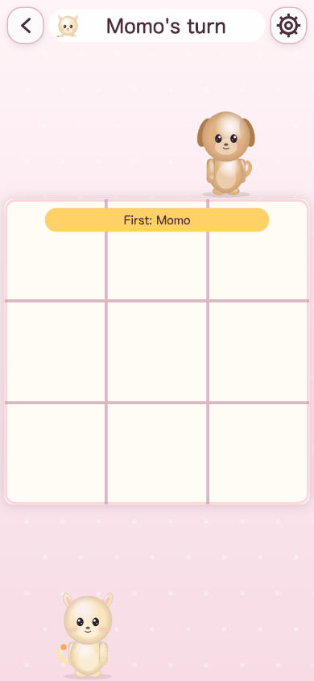
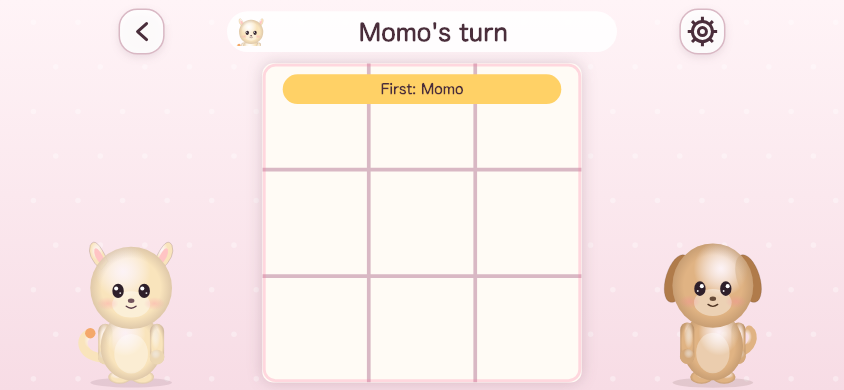
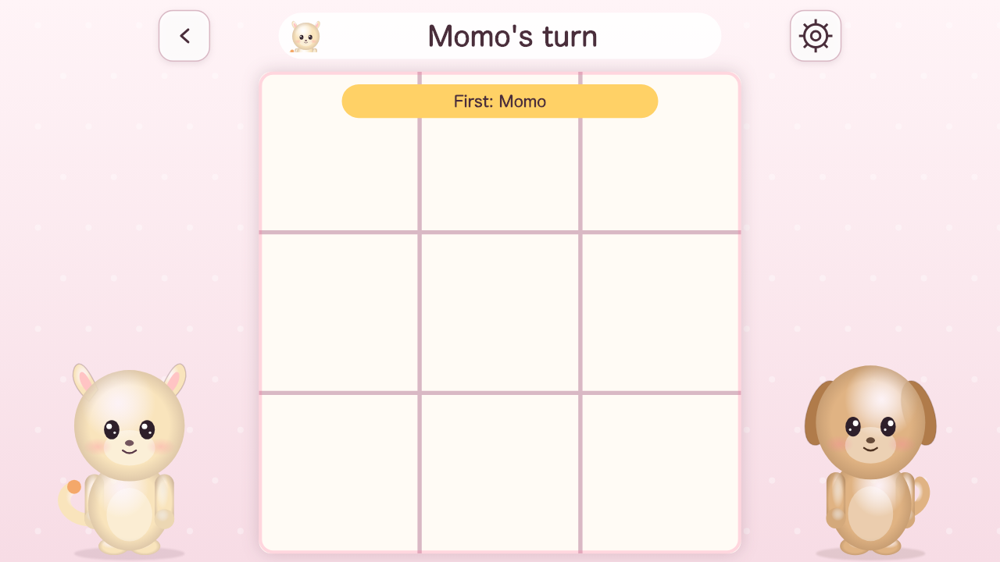
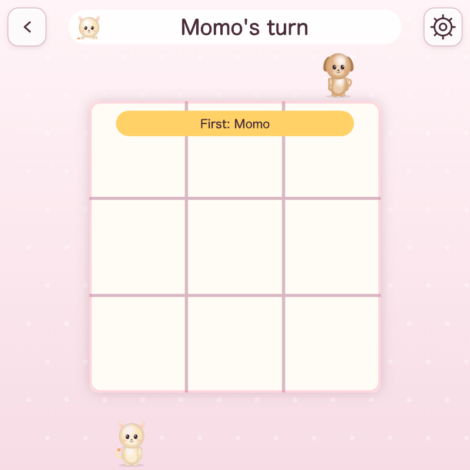
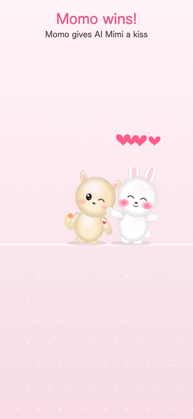
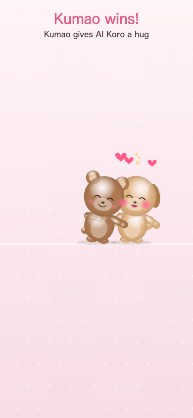
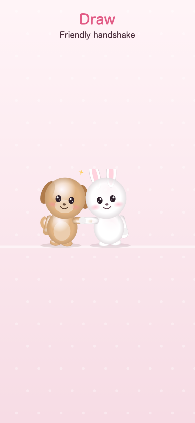
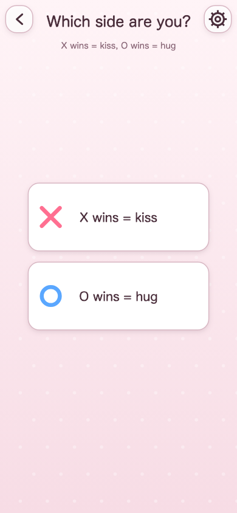
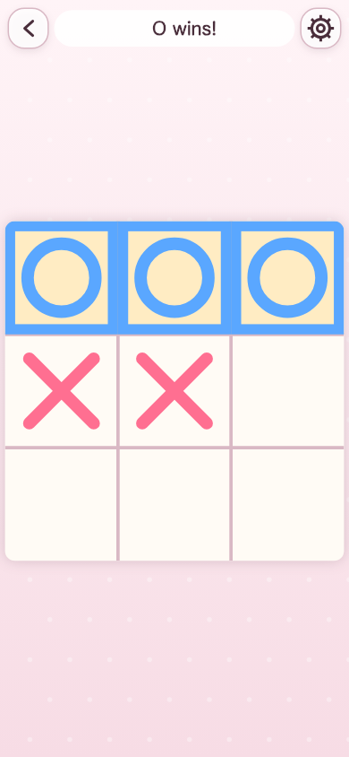
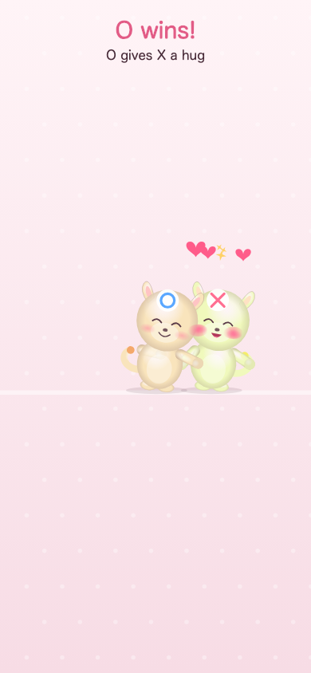

# キスハグ / KissHug — 完了報告 REPORT.md

- 日付: 2026-10-08（v0.3 更新）
- 仕様: SPEC.md v0.3（§6 をポーズ画像方式に書き換え済み）。フェーズ1〜3＋見た目・演出の作り替えを実装済み
- 実装分担: 盤面ロジック（`src/game/`）・AI（`src/ai/`）・演出タイムラインエンジン（`src/fx/`）＋それぞれの単体テストは Codex。画面・画像ローダ・ぬいぐるみ風フォールバック・描画・写真・プラットフォーム層・ビルド・e2e・ドキュメントは Claude Code

---

## 0. v0.3 で変わったこと（ぬいぐるみ風イラスト＋なめらかな演出）

| 項目 | 内容 |
|---|---|
| キャラ表示 | パーツ式リグを**廃止**。ポーズごとの 1 枚絵（`idle, happy, kiss_give, kiss_receive, hug_give, hug_receive, handshake, face`）を `assets/characters/<animal>/` に置く方式。画像が無いスロットは**コードで描くぬいぐるみ風 SVG**（`src/art/plush.ts`: 丸いシルエット、ラジアルグラデーションの陰影、大きなつやつやの目、頬の赤み、耳・しっぽ・色で 4 種を判別）で代替。PNG/WebP を置くと `scripts/art-manifest.mjs`（ビルド時に自動実行）が検出して優先する |
| 写真モード | `assets/characters/photo/` に頭が空白の体スロット。`anchors.json` の `head`（中心・半径）に切り抜いた顔を合成 |
| アンカー | 各キャラ・各ポーズの `feet / head / forehead / eyes / cheeks / top` を `anchors.json` に定義。クラシックでは `forehead` に ✗/◯ バッジ |
| 読み込み | `gameReady` 後に、対局で選ばれた 2 キャラ分だけ遅延ロード。タイトル・選択画面は `face` だけ。画像合計 3MB 超はビルドで停止（現在は画像 0 バイト） |
| 演出エンジン | `src/fx/`（Codex 実装）: 純粋関数 `時刻 → スプライト状態[]`。可変プロパティは **`x, y, sx, sy, rot, opacity` のみ**（`tests/fx.test.ts` が全フレームで検証）。ease-out と cubic-bezier(0.34, 1.56, 0.64, 1) を使い分け |
| 待機 | 1.6 秒周期の呼吸（sy 1→1.035 / sx 1→0.985、2 人は位相ずらし）＋約 3.2 秒ごとに 120ms のまばたきオーバーレイ |
| キス 2.5 秒 | 2 回ホップで寄る（着地 squash 1.08×0.92 → オーバーシュートで戻す）→ 0.25 秒クロスフェード → 頬の赤み → ハート 4 個が上へ漂う（大きさ・タイミングをばらす）→ ホールド → happy へ |
| ハグ 2.5 秒 | ホップ → hug_give を手前に重ねてクロスフェード → 2 人まとめて scale 1→0.94→1 を 2 回（0.35 秒）→ ハート＋キラキラ → happy へ |
| 握手 1.8 秒 | 中央へ 1 ホップ → handshake → 上下 2 回 → キラキラ → happy へ |
| 終了後 | 結果画面のまま happy ポーズで待機ループ（呼吸・まばたき）。演出中タップでスキップ（初回は最後まで） |
| クラシック是正 | 駒は ✗（ピンク）/ ◯（ブルー）のベクター記号のみ。対局前に「あなたは ✗ / ◯」を選ぶ画面（`SideSelectScene`）。動物は結果演出にだけ登場し額にバッジ。勝利ラインは枠を濃く＋薄い黄色でハイライト |
| 選択画面 | カードは `face` 画像。選んだカードが小さく弾んでから次へ |
| ドキュメント | `ART_PROMPTS.md`（ChatGPT 画像生成のプロンプト・参照画像の使い方・透過化・足元合わせ）、SPEC.md §6 書き換え |

### スクリーンショット（`docs/screenshots/`、Playwright で自動生成）

| スマホ縦 390×844 | スマホ横 844×390 |
|---|---|
|  |  |

| PC 1280×720 | 1:1 800×800 |
|---|---|
|  |  |

| キス | ハグ | 握手 |
|---|---|---|
|  |  |  |

| クラシック: 陣営選択 | 勝利ライン | 額バッジ付き演出 |
|---|---|---|
|  |  |  |

### v0.3 の完了条件
| 条件 | 結果 |
|---|---|
| 既存テストすべて通過 | ✅ 単体 26 件（盤面・AI・fx）、e2e 26 件（レイアウト／通信ゼロ／19×19／AI／SDK モック／ZIP／報告用スクショ） |
| 演出が transform/opacity のみで動くことをテストで確認 | ✅ `tests/fx.test.ts`: 3 演出を 16ms 刻みで全サンプルし、スプライトのキーが `x, y, sx, sy, rot, opacity`＋静的な識別子だけであること、クロスフェードで不透明度が保存されること、足が地面より下に行かないこと、終了時に happy ×2 だけが残ることを検証 |
| 4 パターン＋演出 3 枚のスクショを REPORT に添付 | ✅ 上記 |
| SPEC.md §6 を新方式に書き換え | ✅（§2 の方式、§3.1 クラシック、§5 の駒、§9.2 の構成も同期） |
| GitHub Pages にデプロイ | ✅ https://nomoss1784-dot.github.io/kisshug/ |

### v0.3 で判断したこと
- 描画は引き続き Canvas 2D。「transform と opacity だけ」はエンジンの出力契約として実装し、描画側はそれ以外を触らない（DOM/CSS transform に移すと盤面との重ね順や DPR 制御が崩れるため）。
- フォールバック絵は SVG 文字列を `Image` として読み込んで描画（どの拡大率でもにじまない）。同キャラ対戦の 2 体目はパレットの色相を 30° 回して生成。
- フォールバック時はネットワークを一切使わない（画像 0 バイト）。本番画像は `art-manifest` に載ったものだけ読むので 404 の試し撃ちもしない。
- ホップは 320ms（上り 160 / 下り 160）、ハート・キラキラは指定時間内に終わるよう寿命を調整（Codex の解釈）。
- 写真モードの頭は耳・しっぽなしの体（`photo/`）。まばたき・頬の赤みは写真の上にも重ねる。
- クラシックの陣営選択はプレイヤー 1 が行い、2 人対戦では相手が残りの側。✗ 勝ち＝キス、◯ 勝ち＝ハグは据え置き。

---

## 1. 起動方法

```bash
npm install
npm run dev              # 開発サーバ http://localhost:5173
npm run build            # Web版 → dist/
npm run build:playables  # Playables版 → dist-playables/ と提出用 kisshug-playables.zip（index.html がルート）
npm test                 # 単体テスト（Vitest）: 盤面・勝利判定・AI
npm run test:e2e         # Playwright: レイアウト／通信ゼロ／19×19タッチ／AI／SDKモック／ZIP
npm run typecheck
```

- 静的サーバで動かすだけなら `npm run build` 後に `npm run preview`（http://localhost:4173）。
- 本番画像の作り方: `ART_PROMPTS.md`。置くだけで差し替わる（`npm run build` が自動検出）
- Playables SDK のローカルモック: URL に `?mock=playables&lang=ja` を付ける（`window.__ytmock` で pause/resume/音声/言語を操作できる）。
- アンカー JSON の再生成: `node scripts/gen-anchors.mjs`。サムネイル再生成: `npm run build && npm run preview` を起動した状態で `node scripts/gen-thumbnails.mjs`。

## 2. 公開URL

- **Web版（HTTPS）: https://nomoss1784-dot.github.io/kisshug/**
- リポジトリ: https://github.com/nomoss1784-dot/kisshug （public。`gh` が認証済みだったので作成した）
- デプロイ方式: `dist/` を `gh-pages` ブランチに push → GitHub Pages（source = gh-pages, /）。更新手順は §7 末尾。
- 提出用 ZIP: `npm run build:playables` で `kisshug-playables.zip`（158KB）を生成。

## 3. フェーズごとの完了条件チェック結果

### フェーズ1: Web版コア
| 条件 | 結果 | 根拠 |
|---|---|---|
| `game/` 単体テスト: 任意の (size, k) で勝利判定が正しい | ✅ | `tests/winCheck.test.ts`（size 3〜19, k 3〜6 の縦横斜め・k+1・遮断・引き分け・最終手の高速判定と全走査の一致 200局） |
| AI「つよい」が 3×3 で 1000 局負けなし | ✅ | `tests/ai3x3.test.ts`（先手 500 局＋後手 500 局 vs 乱数、負け 0。つよい同士は 10 局すべて引き分け） |
| iPhone縦・Android縦・PC横・1:1 の4パターンで崩れない | ✅ | `e2e/layout.spec.ts`。390×844 / 360×800 / 1280×720 / 800×800 に加え極端比 360×1280（9:32）と 1280×360（32:9）も確認。ボタンが画面内に収まること・盤が正方形で画面内にあること・回転しても対局状態が保持されることを検証。スクショは `e2e/screenshots/` |
| 初期ロード 5MB 以下 | ✅ | `e2e/network.spec.ts`: タイトル表示までの転送量 **95KB / 36 リクエスト**。dist 全体 312KB（JS 90KB、画像 192KB） |
| 外部通信ゼロ | ✅ | `e2e/network.spec.ts`: 自ホスト以外のリクエスト 0 件（初期ロード・写真モード一式）。公開 URL でも 0 件を確認 |
| `dist/` がローカルの静的サーバで動く | ✅ | `vite preview`（Playwright の webServer）で全 e2e を実行。GitHub Pages でも動作 |

### フェーズ2: 機能拡張
| 条件 | 結果 | 根拠 |
|---|---|---|
| 19×19 をスマホ縦（幅360px）で誤タップなく打てる | ✅ | `e2e/board19.spec.ts`（Playwright タッチエミュレーション、360×740）: 四隅・中央・ランダム計10マスを「タップ→拡大レンズ確認→もう一度タップ」で狙い通り配置。レンズ内タップでの隣接マス修正、「ここに置く」ボタン、埋まったマスは無反応、ピンチ後のタップ精度、ダブルタップでズームリセット |
| AI思考がUIを止めない（1.5秒上限） | ✅ | `e2e/ai.spec.ts`: 15×15「つよい」の思考中 1 秒間に **61 フレーム**描画、応答 **1514ms**（Web Worker、上限 1500ms＋通信オーバーヘッド） |
| 写真が端末外に出ない | ✅ | `e2e/network.spec.ts`: `input type=file` に PNG を投入→切り抜き→対局→キス演出まで通して自ホスト以外のリクエスト 0 件。写真は `data:` URL としてメモリ保持、保存は明示オプトインのみ |

その他実装: Lv2（9×9）、Lv3（15/17/19）、ピンチズーム・ドラッグ・ダブルタップ、2段階入力＋拡大レンズ、直前手マーカー、2人対戦（手番表示大・先手表示）、動物ごとの決めポーズ（ねこ: しっぽハート、いぬ: 高速しっぽ振り、うさぎ: 耳ピン、くま: 持ち上げハグ）、写真モード（円形クロップ・体色4色・保存オプトイン・設定から削除）。

### フェーズ3: Playables対応
| 条件 | 結果 | 根拠 |
|---|---|---|
| SDKモック上で `firstFrameReady` → `gameReady` が起動から 3 秒以内 | ✅ | `e2e/playables.spec.ts`: 両方が順番通り呼ばれ、`gameReady` は起動後 1 秒未満 |
| pause/resume で AI思考と演出が止まる・再開する | ✅ | 同上: pause 中は AI リクエスト取消・着手なし、resume で再思考して着手。結果演出のタイマーも停止／再開 |
| ZIP を展開して `index.html` を開くだけで動く | ✅ | `e2e/zip.spec.ts`: ZIP を展開し `file://` で開いてタイトル表示・AI着手・外部通信 0・エラー 0 を確認 |
| `REPORT.md` が揃っている | ✅ | 本書 |

SDK 連携一覧（`src/platform/playables.ts`）: `firstFrameReady`/`gameReady`、`onPause`/`onResume`、`isAudioEnabled`/`onAudioEnabledChange`（効果音ON/OFF追従）、`getLanguage`（ja/en）、`saveData`/`loadData`（設定・戦績・オプトイン写真を1つの JSON にまとめて保存）、`sendScore`（つよいAIへの連勝数）、`requestInterstitialAd`（3対局ごとの結果画面を閉じるとき）、`requestRewardedAd`（`Platform.showRewarded()` としてフックのみ）、`logError`/`logWarning`、`IN_PLAYABLES_ENV`。ゲーム本体は `Platform` インターフェース以外から SDK に触らない。

## 4. 仕様書から判断で決めたこと、変えたことと理由

1. **ゲームエンジン: Phaser ではなく plain Canvas 2D**（§9.1/§11 で許容）。理由: バンドルが 90KB（Phaser は約 1.3MB）で `gameReady` までが軽い、DPR と文字のにじみを完全に制御できる、依存ゼロで Playables の CSP/オフライン要件に強い。シーン管理・トゥイーン・ジェスチャ認識は `src/ui/` に自前実装（約 600 行）。
2. **ビルドを単一の classic `<script defer>`（IIFE）にした。** ES module だと「ZIP を展開して index.html を開くだけ」（file://）で動かないため。`anchors.json`・画像マニフェスト・効果音マニフェストも fetch ではなくビルド時にバンドル（ファイル自体は仕様通り `assets/` に置いてあり、編集すれば反映される）。
3. **Worker が使えない環境ではメインスレッドで探索**（file:// では Chrome が Worker を拒否する）。http 配信では常に Worker。
4. **効果音は WebAudio で合成**（音声ファイル 0 バイト）。`assets/sfx/manifest.json` に `"place": "./sfx/place.mp3"` のように書けばファイル再生に切り替わる（§9.5 の OGG/MP3 差し替え前提）。
5. **Lv3 の盤サイズは 15 / 17 / 19 の3択**（§5 は 17 を許容、§11 は 15/19 の2択で矛盾。上位互換として 3 択。既定 15）。
6. **2段階入力の確定とダブルタップの両立**: マス選択後 0.3 秒以上おいて同じマスを再タップで確定、素早いダブルタップはズームリセット（選択も解除）。確定は「ここに置く」ボタンでも可。ズーム中は盤右上に「⤢」リセットボタンも出す。
7. **拡大レンズ**: 選択マスの周辺 5×5 を円形レンズに拡大表示し、レンズ内のマスを直接タップして選び直せる（19×19 の 18px マスでも 30px 以上で狙える）。
8. **クラシックの陣営**: プレイヤー1 = ○（ハグ）、プレイヤー2／AI = ✗（キス）。先手は対局ごとに交代するので ✗ が先手になることもある（§4 の交代ルールを優先）。
9. **AI のご褒美**は対局ごとにランダム、「もう一回」でも再抽選。AI の動物もランダム（同じ動物なら色相を 30° ずらす）。
10. **写真モードの頭**: 耳としっぽは描かない（人の顔に動物の耳は不自然）。感情は頬の赤み・ハート・キラキラの重ね描きで表現（§6.4）。写真プレイヤーの名前は「プレイヤー1/2」。
11. **写真の保存**: 「次回も使う」トグルON時のみ `Platform.save`（Web: localStorage、Playables: saveData）。256×256 PNG の data URL（1枚 50〜150KB）なので 3MiB に収まる。設定画面の「保存した写真を消す」で削除。
12. **言語**: 初回は端末／YouTube の言語（ja なら日本語、他は英語）。設定で明示切替。
13. **初回の演出はスキップ不可、2回目以降はタップでスキップ**（キス・ハグ・握手それぞれ別に記録）。
14. **キーボード**: Esc で設定・選択中マスを閉じる（`preventDefault` しない）、Enter で選択マス確定、Enter/Space でタイトルから開始。
15. **サムネイル**はタイトル画面の 4 キャラだけ（文字・ロゴなし）を 16:9 / 9:16 / 1:1 / 4:3 で `submission/thumbnails/` に生成。
16. **デバッグ用フック** `window.__kisshug` を本番ビルドにも残している（e2e が使用。数十バイト。消す場合は `src/main.ts` 末尾）。
17. **5体目スロット**: キャラ選択に「？」のロック枠を置き、タップで「いつかなかまがふえるかも」を表示。`Platform.showRewarded()` は用意したが UI からは呼ばない（解放対象がないため）。
18. **カメラ直接撮影（getUserMedia, MAY）**: 未実装。Playables の iframe 内で動くか不明なため（§7.1 の方針通り）。

## 5. できなかったことと理由

- **実機（iPhone Safari / Android Chrome）での確認**: Chromium のエミュレーション（Playwright, タッチ・DPR 2）でのみ検証。ピンチは 2 本指のエミュレーションができないため、ジェスチャ認識器（`src/ui/app.ts`）の出力を直接呼んでカメラ計算を検証した。実機では §12 の Test Suite 確認と合わせて触ってほしい。
- **Playables 本番環境**（Developer Portal / Test Suite）: アクセス不可のため `src/platform/mock.ts` のモックで代替。SDK の API 形は公式リファレンス（`ytgame.game / system / engagement / ads / health`）に合わせてある。
- **本番アート・効果音**: すべてプレースホルダ（§6.3 の構造に従い PNG 差し替えだけで本番化できる。手順は §7）。
- **安いAndroid端末での性能**: 未計測。描画は毎フレーム全再描画だが 19×19 でも可視セルのみ描画、Playwright 上で 60fps。

## 6. 人間タスク一覧（§12）

1. NOMOSS 名義の YouTube チャンネル作成
2. Playables 興味表明フォームへの申請（公開URL https://nomoss1784-dot.github.io/kisshug/ を添えて）
3. 承認後、Developer Portal の Test Suite で動作確認。特に **写真モードの `input type=file`** が iframe 内で動くか。動かない場合は `vite.config.ts` の `__PHOTO_MODE_ENABLED__` を `mode === 'playables' ? false : true` にして Playables 版だけ写真モードを隠す（モード選択から消える）
4. 本番アート PNG の差し替え（§7）
5. サムネイルの本番化（`submission/thumbnails/` のプレースホルダを置き換え。ロゴ・文字なし）
6. 効果音の本番化（任意。`assets/sfx/` に置いて `manifest.json` に登録）
7. 審査提出（タイトル: キスハグ / KissHug、ジャンル: Casual、パブリッシャー: NOMOSS、ZIP: `kisshug-playables.zip`）
8. 実機での触り心地確認（19×19 のレンズ・ピンチ）

## 7. 本番アートの差し替え手順

詳細は **`ART_PROMPTS.md`**（プロンプト、参照画像で全ポーズを揃える手順、白背景の透過化、足元の揃え方）。要点:

| 置き場所 | ファイル | サイズ | 備考 |
|---|---|---|---|
| `assets/characters/{cat,dog,rabbit,bear}/` | `idle, happy, kiss_give, kiss_receive, hug_give, hug_receive, handshake` `.png`/`.webp` | 600×600 透過 | 全員右向き。足裏の中心を (300, 560) に。身長約 500px |
| 同上 | `face.png` | 256×256 | 盤面の駒・選択カード・タイトル |
| `assets/characters/photo/` | 上と同じ 7 ポーズ | 600×600 透過 | 頭が空白の丸の体。白〜薄ピンクで描く（色は実行時に乗算） |
| 各フォルダ | `anchors.json` | — | `feet / head / forehead / eyes / cheeks / top`、`eyelid`（まぶた色）、`eyeWidth`。既定値はフォールバック絵に合わせてある |
| `assets/sfx/` | `place win draw button kiss hug shake` の mp3/ogg | 各 1 秒以内 | `manifest.json` に登録 |

- 置いたら `npm run build`（`art manifest: N image slots, X KB` と出る）。3MB を超えるとビルドが止まる。
- 画像が無いスロットだけフォールバックになるので、1 枚ずつ差し替えて確認できる。
- 演出のタイミング・動きは `src/fx/ceremony.ts`（Codex 実装、キーフレームは ms 指定）。

### 公開の更新（GitHub Pages）
```bash
npm run build
cd dist && git init && git checkout -b gh-pages && touch .nojekyll && git add -A && git commit -m deploy && git push -f https://github.com/nomoss1784-dot/kisshug.git gh-pages
```
